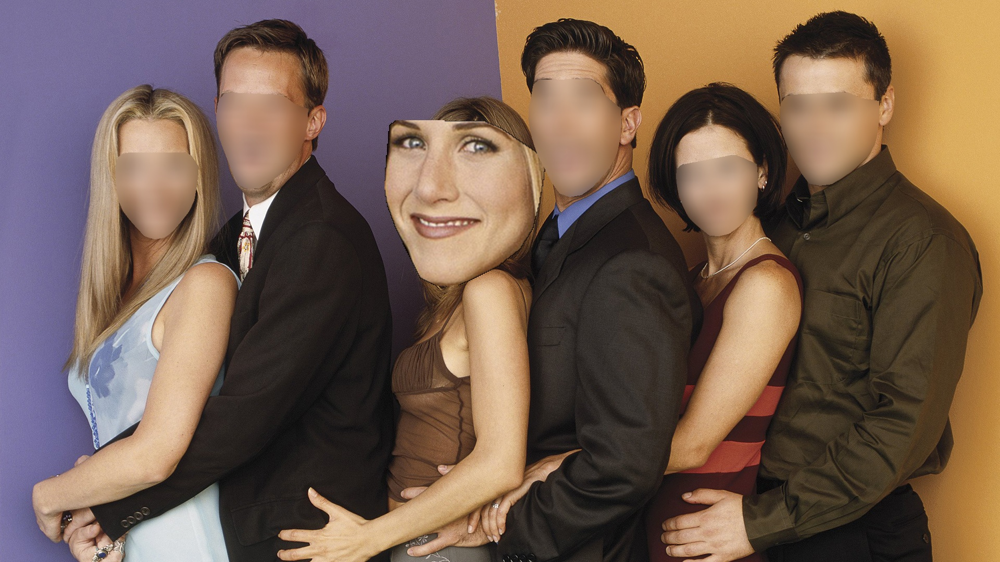

# BlurMyFriends
#### Ever find yourself staring at group photos, trying to figure out who’s who in the dating scene?

This is a tool designed to elevate your dating profile by applying a unique blur effect that highlights you while keeping everyone else subtly in the background. It ensures your profile stands out and maintains the privacy of others by blurring their identities, making you the undisputed star of the show.

It is a spin-off version of my previous project [AutomaticFaceBlur](https://github.com/PSY222/AutomaticFaceBlur/tree/main) which smoothly blurs people's face in a visually comforting way by following the face contour line of individuals.

*Keywords: Face detection, Face Recognition, Image Processing, OpenCV*

### Model Overview and Technical Justification
1. Face Detection and Recognition: MediaPipe

**Face Detection and Recognition**: MediaPipe provides efficient, real-time face detection and recognition. Its integrated approach offers high accuracy and minimizes system complexity, making it ideal for quick and reliable face processing.

2. Face Blurring Effect: OpenCV and dlib

**Blurring Effect**: We use OpenCV to apply a custom blurring effect that highlights the face. The blurring mask is crafted using dlib’s face landmarks, ensuring the blur follows the natural contours of the face for a seamless look.

**Reasoning**: MediaPipe’s unified detection and recognition streamline the process, while OpenCV and dlib’s precise contouring create a visually appealing blur. This combination balances performance, accuracy, and privacy, enhancing your profile image effectively.

### Filter Outputs
This repository provides 3 filters (RedArrow, I'm Here sign, Enlarge Face) to highlight your face. You can add more filters by modifying filters.py file or adding filter images on the images/filter/. directory.

RedArrow Example1           |  RedArrow Example2
:-------------------------:|:-------------------------:
  |  

ImHere Example           |  Enlarge Face Example
:-------------------------:|:-------------------------:
  |  

Stop letting group photos steal your spotlight! Shine brighter than ever by putting the focus on yourself. Let's get your profile stand out and respect your friends’ privacy. 

Create a safe and trustworthy dating experience with a profile that truly puts you in the spotlight!